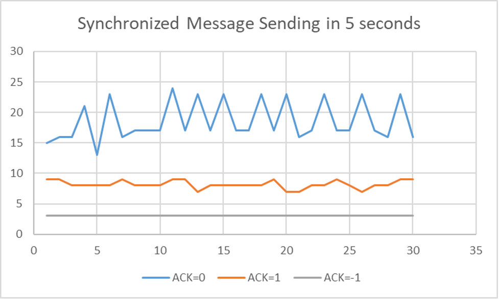
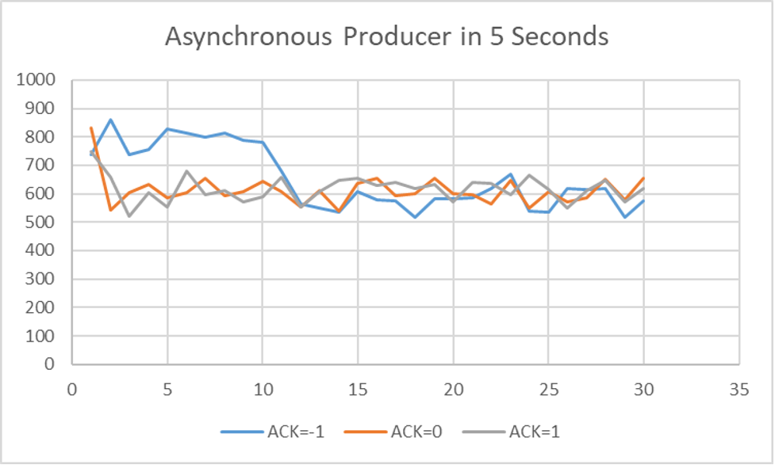
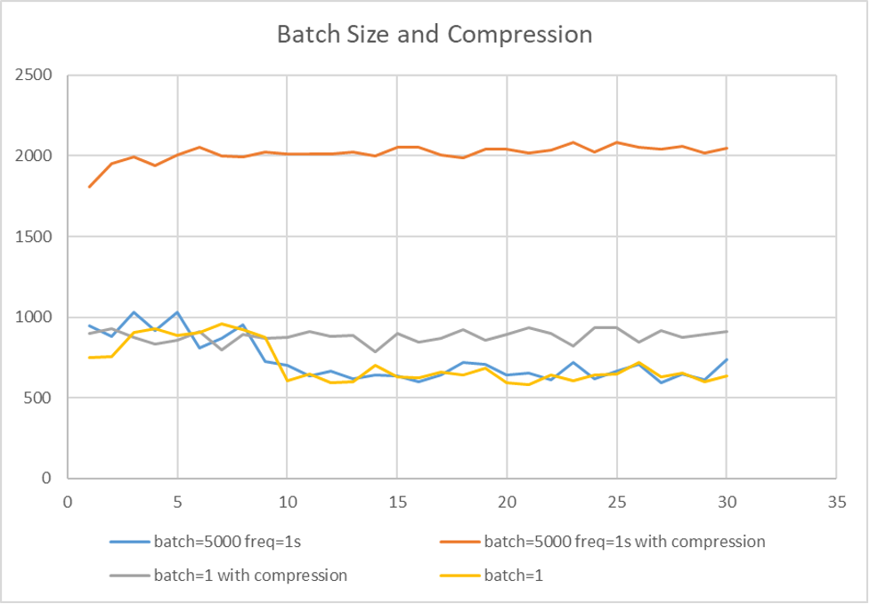

# Distributed WAL and Recovery with Kafka


## Goal: 

Right now Kafka keeps replicas of WALs on different partitions(nodes), and whenever Kafka brokers receive messages from the producers(Source of data), they duplicate those messages on different nodes and wait for the responses from those nodes before they send ACKs back to the producers.

This introduces an issue: if there are a large amount of WALs transmitting from producers to brokers, then brokers probably would not be able to keep up, since they are doing 2 roundtrips of request/response: the first is between brokers and producers, second is between different brokers.

Our goal is to improve the throughput of Kafka, while <b>ensuring message ordering and no message loss</b>.

## Ideas of improvement

1. Branch1: the retention period of Kafka is the time period that Kafka would save the received data in the system. The default retention period in Kafka is 7 days. However, because we are working with WAL, we don't need Kafka to hold on to those WALs for too long. WALs are meant to be held for no more than 1 minutes. One Branch of idea is to cut down the retention period to we achieve better throughput.
   1. Can we set Kafka to only use memory? If the current retention period is as long as a few days, then no doubt kafka is saving WALs in persistent storage, if we turn that off, surely the throughput will improve.
   2. If we only need kafka to keep the WALs for a few seconds, do we really need to keep all those replicas on different nodes? What are the chances that those messages got loss in a few seconds?


2. Branch2: According to Franco, right now the leading broker (the broker that takes WALs off the hands of producers) will wait for the responses from all the follower brokers (the brokers that take WALs from leader broker) before sending ACK back to producers. Apparently this is the safest way to transfer messages between brokers and producers, but is this the most efficient way?
   1. Can we make the leader broker send ACK immediately after receiving message from producer? Then if something goes wrong, it can probably send a error message back to the producer to let it know. (what if the leader died? Then every message on the leader node will be lost and it cannot send error message to the producer, while the producer will never know the loss of these messages since they have already beeen ACKed)

3. Branch3 of ideas: According to Franco, the bottleneck of Kafka might be the disk IO throughput if we cannot make kafka only writing to memory, then we can create RAM disk. We make some part of RAM as a disk volume, like /data/b1, then we let kafka writing to that RAM volume. This might improve the throughput.

4. Branch4 of ideas: There are some other parameters in the brokers that we can tune. We can also try tune those parameters.

5. Branch5 of ideas: If all above ideas does not improve the performance, then we can write our own brokers, which should be really, really simple. And if we choose this option, we do not need to worry about the consumers. We only need to write a broker that use grpc streamers (which Franco recommend): the producer use a channel to send messages like (id int, data bytes[]) to the broker, and the broker use another channel to respond messages like (id int, isSuccessful bool) to the producer.
   And we do not need to worry about consumer at all.

  

## Our plan

1. Try tune retention period and maybe other brokers parameters.

2. Try if we could let Kafka only store messages in memory.

3. Try RAM disk.

4. Try writing our own brokers.


## Task1: Benchmark on Kafka
### Configurations and evaluation setup:
- Windows 10
- Sarama Kafka implementation in Golang (https://github.com/Shopify/sarama)
- 1 topic, 3 partitions, replication-factor set to 3
- Producer randomly selects 1 out of 50 WALs and send it to the Kafka cluster, repeat this process until either it reaches a timeout or encounters an error
- Simple console consumer

### Progress & Findings: 
   - Tested both sync producers and async producers.
   - With sync producers, these parameters were tested:
      - Acks: We tested all 3 different values for ```Acks```, and its value has significant influence over the performance of sync producer.
      - Compression: we tested all the supported compression methods currently supported by Kafka(LZ4, zstd, gzip, snappy) with the sync producer, no significant improvement spotted.
      - Given the nature of the sync producer, no message batching can be performed.
   - With async producers, these parameters were tested:
      - Acks: We tested all 3 different values for ```Acks```, and no significant difference spotted.
      - Compression with batching: We tested grouping 5000 messages into one batch then apply compression method on the batch before sending, this shows significant improvement: throughput is almost doubled.
      - Only applying compression or message batching shows no significant improvement when compared to the default setting(no batching, no compression)
   - We also find out that the async producer implemented by Sarama generally has a significantly better throughput than the sync prodcuer

### Some benchmark results:
*all the benchmarks in the same category were run consecutively on the same machine. We assume that the performance of the machine did not change much during this time.*

<p align="center">

</p>
<center>Image1</center>

*Image1* shows Synchronized Producer's throughput (measured with the total size of sent messages in MB in 5 seconds), given different values of ```Acks```. The Y-axis shows the total size of messages in MB while the X-axis shows how many times this benchmark test was run. We run the same test multiple times to mitigate system performance fluctuations. <b>The following images' X-axis and Y-axis are measured the same way.</b>

It is clear to see that when ```Acks``` is set to ```-1``` (wait-for-all mode), the producer has the worst throughput; while when it is ```0```(fire-and-forget mode), the producer achieves the best throughput.

<p align="center">

</p>
<center>Image2</center>

*Image2* shows Asynchronous Producer‘s throughput, with all other configurations remain unchanged. The result shows that the setting of ```Acks``` is no longer a dominant factor that significantly affects the throughput.

<p align="center">

</p>
<center>Image3</center>

*Image3* shows how message batching and compression could influence async producer's throughput. ***batch=m*** means ***m*** messages are grouped in a batch before sending; ***freq=n*** means the current batch will be flushed to the cluster after ***n*** seconds, whether filled with ***m*** messages or not.

This plot shows that when message batching and compression are both performed(on the producer side), the throughput experiences a great improvement; however, when only one is performed, the throughput is almost the same as the default setting's.


## Task2: Rentention Period Tests

The idea is that we can try to set the retention time to 1 minute instead of 7 days, there may not be any need of flushing to the disk. Therefore, the overall throughput may inprove. The following the testing outcomes:

***Test1***: Synchronous producer, Replication factor = 3, partitions = 3, ack = 1

OS X with Intel i5-8259U CPU @ 2.30GH, 8GB Memory, 256 GB SSD

| Retention time | Average throughout per second |
| -------------- | ----------------------------- |
| 7 days         | 9.23 MB                       |
| 1 minute       | 9.3 MB                        |
| 5 seconds      | 9.23 MB                       |


***Test2***: Asynchronous producer, Replication factor = 3, partitions = 3

OS X with Intel i5-8259U CPU @ 2.30GH, 8GB Memory, 256 GB SSD

| Retention time | Average throughout per second |
| -------------- | ----------------------------- |
| 7 days         | 168.8 MB                      |
| 1 minutes      | 168.9 MB                      |
| 5 seconds      | 168.7 MB                      |

There is no significant improvement by simply reducing the retention time.


## Task3: RAM Disk Tests

In kafka, the bottleneck of Kafka might be the disk IO throughput. And because we are using Kafka as distributed write-ahead logs, and the data only needs to be retained for a short time. So, the idea is to skip over the disk, and let Kafka only write to memory, so that we completely remove disk IO. We’ve searched way to do this. But unfortunately, we found that Kafka can not be configured to not retain. Kafka automatically writes messages to disk, so it retains them by default. This is a conscious decision by the designers of Kafka. Therefore, we need to find another solution.


An alternative way is to use RAM Disk. The RAM disk is a block of random-access memory (primary storage or volatile memory) that a computer's software is treating as if the memory were a disk drive (secondary storage). Generally, the performance of a RAM drive is orders of magnitude faster than other forms of digital storage, such as SSD, tape, optical, hard disk, and floppy drives. Here are some tests we've conducted:


***Test1***: Synchronous producer, Replication factor = 3, partitions = 3,

OS X with Intel i5-8259U CPU @ 2.30GH, 8GB Memory, 256 GB SSD

|  MB/5s | SSD |  RAM Disk |
|---|---|---|
|  Ack = -1 |  6| 7 |
|  Ack = 0 |  38|  42 |
| Ack = 1  |  11| 13 |

Observation: RAM Disk does not improve the throughput a lot.

Possible reason: Generally, the disk throughput of an SSD is much larger than 40 mb/s. So the reason might be that, in this case, the bottleneck is not the disk IO, but it is the synchronous producer.


***Test2***: Asynchronous producer, Replication factor = 3, partitions = 3​

Windows 10 platform, 9GB of RAM Disk, Plenty of storage on SSD

|  MB/5s | Mechanical Disk |  RAM Disk |
|---|---|---|
|  Ack = 1 |  141| 102 |

Observation: We observe a decrease in performance when we switch from Mechanical disk to RAM disk.

Possible reason: The reason might be that 9GB of ram is constantly using swap memory on disk. So that the data is actually reading from and writing to disk. And the performance is not improved by using RAM disk.


***Test3***:Asynchronous producer, Replication factor = 3, partitions = 3​

Windows 10 AMD R5 3500X @ 3.60GHz, 16GB memory, 1024 GB mechanical disk

|  MB/5s | Mechanical Disk |  RAM Disk |
|---|---|---|
|  Ack = 1 |  134| 137 |

Observation: As we can see, the throughput using Mechanical disk is 134 mb/5s, which is really close to the throughput on ram disk. By calculating the average throughput which is 27 MB/s, we found that this number is far below the average IO throughput of mechanical disk. We might conclude that, also in this experiment, the bottleneck is not the disk IO, but it is the synchronous producer.


***Test4***: Asynchronous producer, Replication factor = 3, partitions = 3

Linux with Intel(R) Xeon(R) CPU @ 2.20GHz, 32GB memory, 256 GB mechanical disk

|  MB/5s | Mechanical Disk |  RAM Disk |
|---|---|---|
|  Ack = 1 |  340| 435 |

Observation: There is an improvement in the throughput when we change from mechanical disk to RAM disk.

Possible reason: Now, the average throughput on mechanical disk is 340/5=68 MB/s, this very close to the average throughput of a mechanical disk, which is around 70 MB/s. The average throughput on ram disk is 87 MB/s. In this experiement, the disk throughput might be the bottleneck since we are approaching the average throughput of mechanical disk. Using RAM Disk speed up the input/output performance. So that we observe a decent improvement in the performance.


## Ramdisk Testing Procedure
Asynchronous producer, Replication factor = 3, partitions = 3
Windwos 10 AMD R5 3500X @ 3.60GHz, 16GB memory, 1024 GB mechanical disk

I start Kafka in Docker Desktop and run the benchmark in both cases: docker-desktop-data in ramdisk and in HDD.
I move the docker-desktop-data distro from HDD to ramdisk referring to: https://dev.to/kimcuonthenet/move-docker-desktop-data-distro-out-of-system-drive-4cg2
The result: (ACK = 1)

**134 MB/5s** for HDD and **137 MB/5s** for RAM Disk.
For the tool I used to mount my RAM as a disk:
- ImDiskTk-x64 (Some errors occur when I move the docker-desktop-data, so I give up using this)
- Arsenal-Image-Mounter-v3.6.188 (Succeeded)


Synchronous producer, Replication factor = 3, partitions = 3
OS X with Intel i5-8259U CPU @ 2.30GH, 8GB Memory, 256 GB SSD

1. Create RAM Volume, "-nomount" asks the OS not to mount this volume.

   ```
   $ hdiutil attach -nomount ram://131072
   ```

2. Create file system on the RAM volume, here we create HFS+.

   ```
   $ newfs_hfs -v 'Ramdisk' /dev/disk2
   ```

3. Mount RAM disk.

   ```
   $ mkdir -p ~/Ramdisk
   $ mount -o noatime -t hfs /dev/disk2 ~/tmp/kafka-logs
   ```

4. After we have created the RAM disk, follow the [How to run it][##How to run it] Part to start Kafka.


Asynchronous producer, Replication factor = 3, partitions = 3
Linux with Intel(R) Xeon(R) CPU @ 2.20GHz, 32GB memory, 256 GB mechanical disk

1. Create RAM Volume and mount it.

   ```
   $ sudo mount -t tmpfs -o size=50g tmpfs ~/tmp/kafka-logs
   ```

2. After we have created the RAM disk, follow the [How to run it][##How to run it] Part to start Kafka.


## About the code

### Notes
The code provides a clean way to test the performance/throughput of Kafka producer in a comprehensive test suite. You can load any number of Kafka configurations and see their benchmark result. To change/add more Kafka configurations, navigate to ```main.go``` and add a set of ```Options``` here:
```
// use options to configure kafka settings. This function returns two slices of configurations
// one for async producer and one for sync producer.
func getKafkaConfigs() ([]*sarama.Config, []*sarama.Config) {
	return []*sarama.Config{
			newKafkaConfig(WithIdempotenceEnabled(), WithMaxReqNum(1), WithFlushThreshold(1)),
			newKafkaConfig(WithWaitForLocal(), WithMaxReqNum(5), WithFlushThreshold(1)),
		}, []*sarama.Config{
			newKafkaConfig(WithWaitForLocal(), WithFlushThreshold(1), WithReturnSuccess(true)),
			newKafkaConfig(WithNoResponse(), WithFlushThreshold(1), WithReturnSuccess(true)),
			newKafkaConfig(WithWaitForAll(), WithFlushThreshold(1), WithReturnSuccess(true)),
		}
}
```
If needed, write a new ```Option``` in ```config.go```.

### How to run it
1. Get Kafka from here: https://www.apache.org/dyn/closer.cgi?path=/kafka/3.1.0/kafka_2.13-3.1.0.tgz
   ```
   $ tar -xzf kafka_2.13-3.1.0.tgz
   $ cd kafka_2.13-3.1.0
   ```
2. Start the Kafka environment (must have Java 8+ installed)
   ```
   $ bin/zookeeper-server-start.sh config/zookeeper.properties
   ```
   In another terminal, run
   ```
   $ bin/kafka-server-start.sh config/server.properties
   ```
   To start addtional brokers, do the following:
   ```
   $ cp config/server.properties config/server-1.properties
   $ cp config/server.properties config/server-2.properties
   ```
   Then, set the following fields in ```config/server-1.properties```, and ```config/server-2.properties```:
   ```
   broker.id=1
   listeners=PLAINTEXT://:9094
   log.dirs=/tmp/kafka-logs-1
   ```
   ```
   broker.id=2
   listeners=PLAINTEXT://:9095
   log.dirs=/tmp/kafka-logs-2
   ```
   Lastly, run the following commands in two new terminals:
   ```
   $ bin/kafka-server-start.sh config/server-1.properties
   $ bin/kafka-server-start.sh config/server-2.properties
   ```

3. Create a topic to store events
   ```
   $ bin/kafka-topics.sh --create --replication-factor 3 --topic WAL-benchmark --bootstrap-server localhost:9093
   ```

4. (Optional) Check Kafka configs:
   ```
   $ bin/kafka-topics.sh --describe --topic WAL-benchmark --bootstrap-server localhost:9093
   ```
   You should see that the replication factor is now 3.

5. Navigate to our repo's root dir, install related dependencies, and run the code
   ```
   $ go install
   $ go run cmd/*.go
   ```
6. To terminate and clean-up, do the following:
   ```
   $ rm -rf /tmp/kafka-logs /tmp/kafka-logs-1 /tmp/kafka-logs-2 /tmp/zookeeper
   ```
7. Find the file ```result.csv``` under the ```data/results```, the throughputs and its configs are written to this file.
